# Quarkus And OpenAPI - Accelerating REST API Development

It is often the case that development of software is done by teams which specialize and
work independently of one another. Some people work on the backend API and others work
on the user interface. This is intended to speed up delivery by allowing parallel
work streams, but there are difficulties when it comes time to integrate the two and
"integration parties" which might sound fun are actually desperate flailing to make
things work together on a time crunch. What if you could make development go even
faster while reducing or eliminating integration issues? That's where [Apicur.io](https://apicur.io/)
and [OpenAPI Generator](https://openapi-generator.tech) can help.

## The Scenario
In this demo we will show:
* Creation of an OpenAPI v3 specification
* Using that OpenAPI specification to generate MOST of the server code
* Using the OpenAPI specification to generate the Client SDK for the web application
* Using [Quarkus](https://quarkus.io/) with Hibernate and Panache to implement the server
* Nearly **0** integration issues

## The Starting Point

Assume that your disparate development teams have done user research and determined
what is needed for a successful *Todo* application. They have decided that each *Todo*
item will have the following JSON structure:

```json
{
  "title": "The title of the Todo",
  "description": "Details for the Todo",
  "complete": false,
  "dueDate": "2019-12-22T09:00:00Z"
}
```

## Creating the OpenAPI Specification With [Apicur.io](https://apicur.io/)

1. Open your browser and navigate to https://apicur.io/
1. Click on *Try Live*  
   * 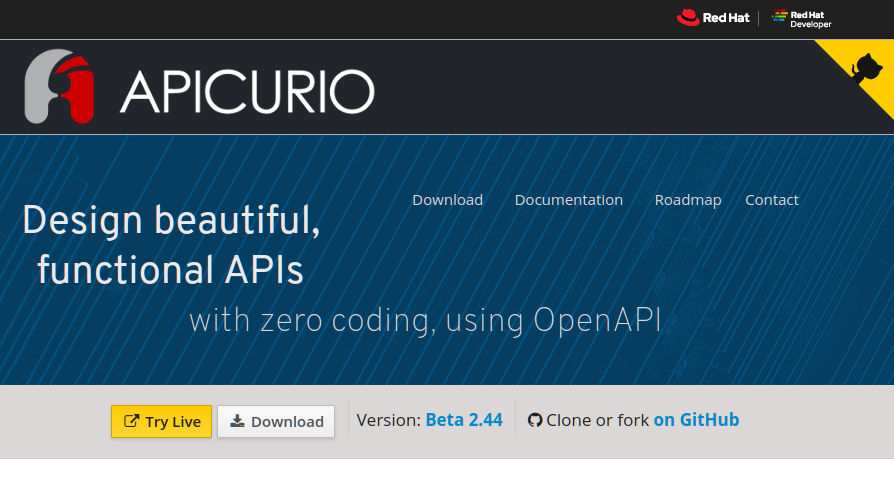
1. Register or log in to the Apicur.io Studio  
   * 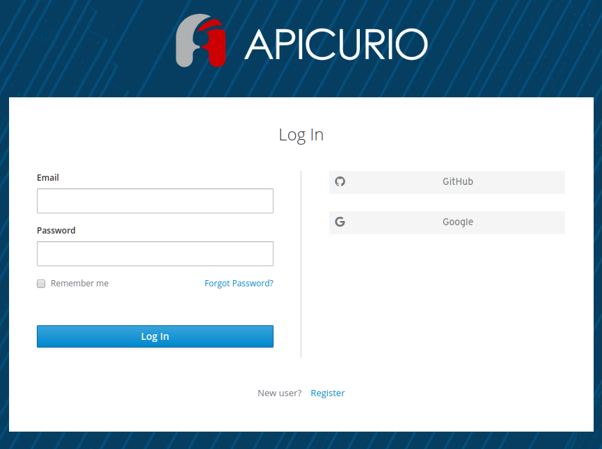
1. Click on *Create New API*  
   * 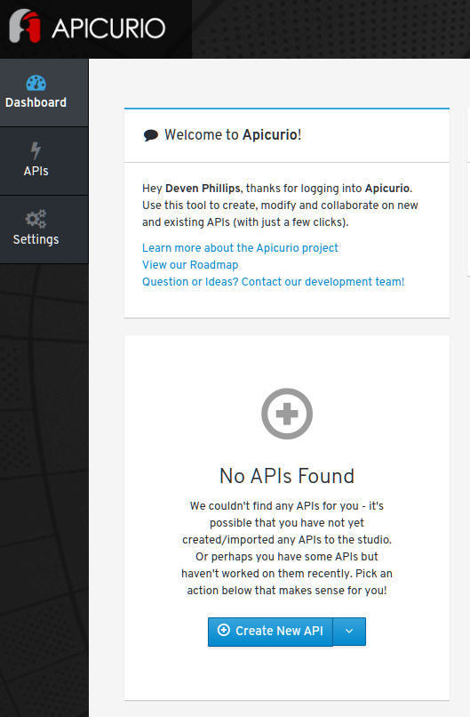
1. Fill in the name and description of the API  
   * 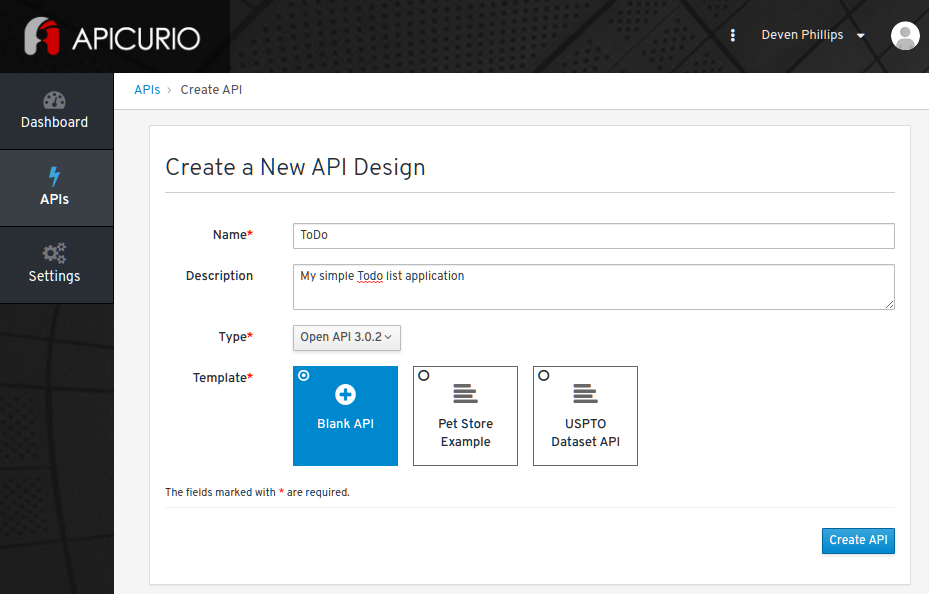
1. Click *Edit API* 
   * 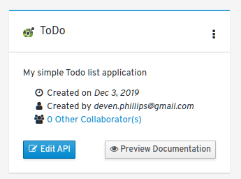
1. Click on *Add a data type*
   * 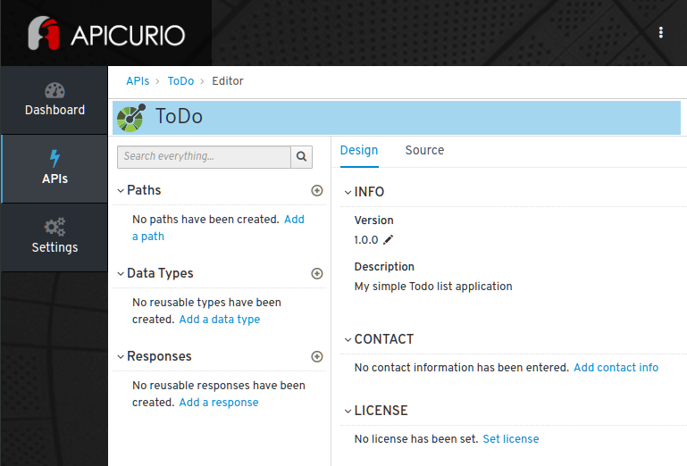
1. Give the data type a name (ToDo), paste the JSON from above into the example JSON, and optionally fill in a description for the data type.
   * 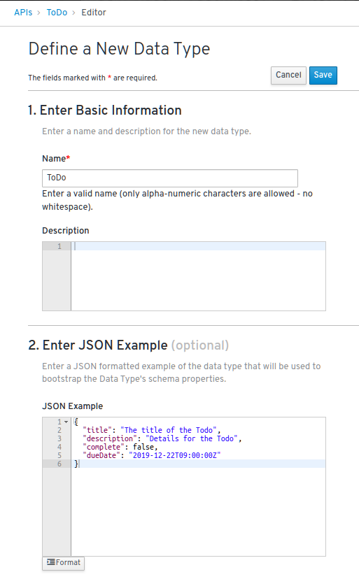
1. On that same page, scroll down to the **Choose to create a REST Resource with the Data Type** and select **REST Resource**
   * 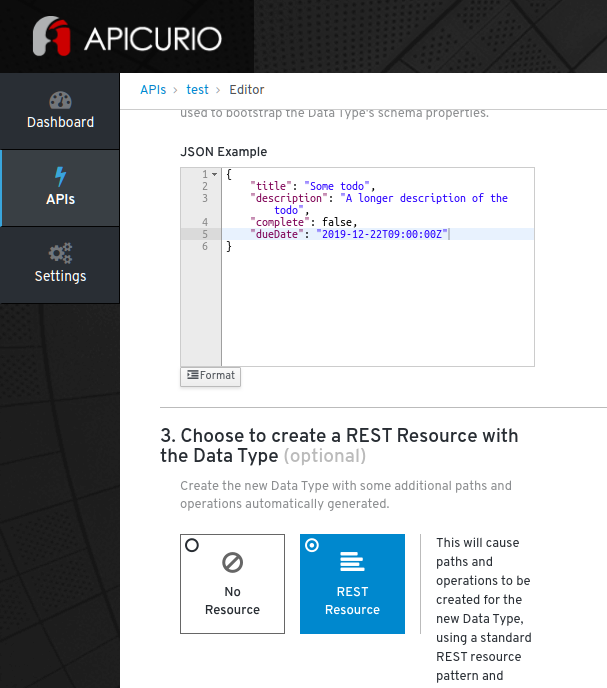
1. Click save and see that Apicur.io has created the standard REST endpoints for you!
   * 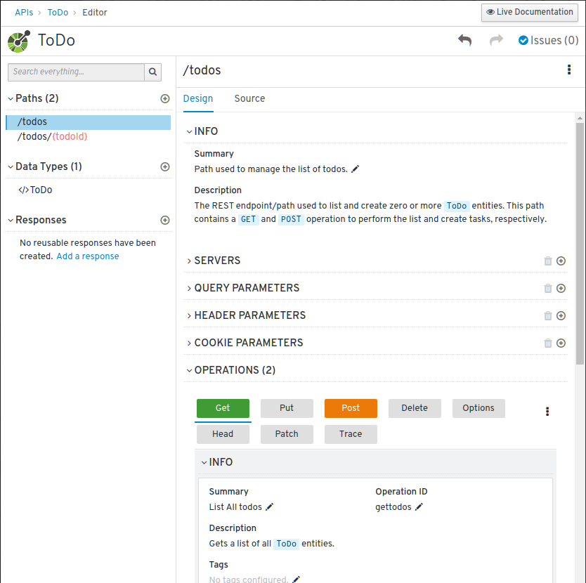
1. One caveat, Apicur.io assigns title to the data types and some code generators try to use those titles in the code. This can lead to unwieldy naming, so I usually simplify the title in Apicur.io
   * 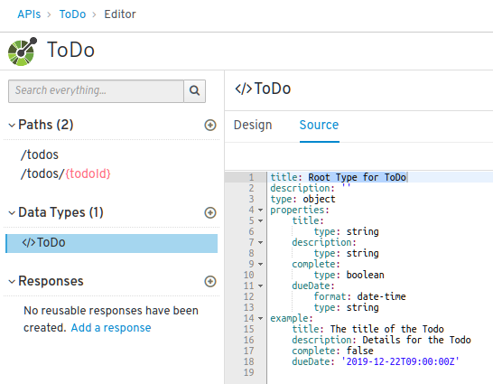
   * Change it to simply **Todo**

That's it! We've created our API Specification!!

## Generating your server code

### Method 1: Use Apicur.io
1. In Apicur.io, navigate up to the APIs list
   * 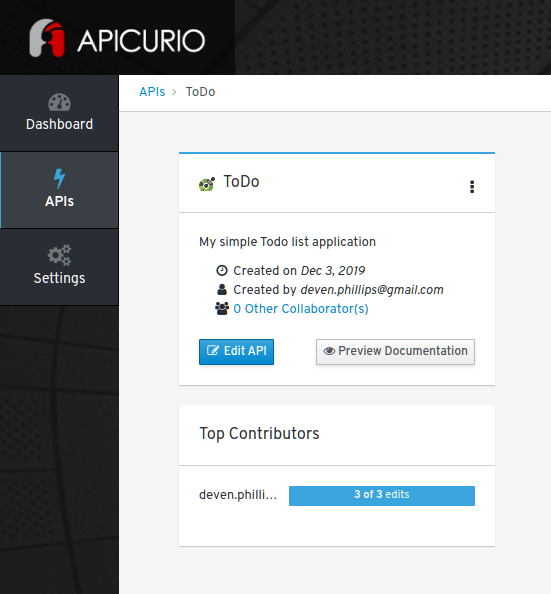
1. Click on the ellipses menu and select **Generate Project**
   * 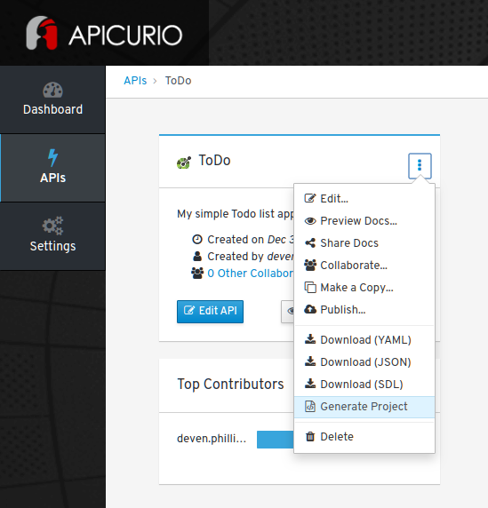
1. Follow the wizard to generate a Quarkus application
   * 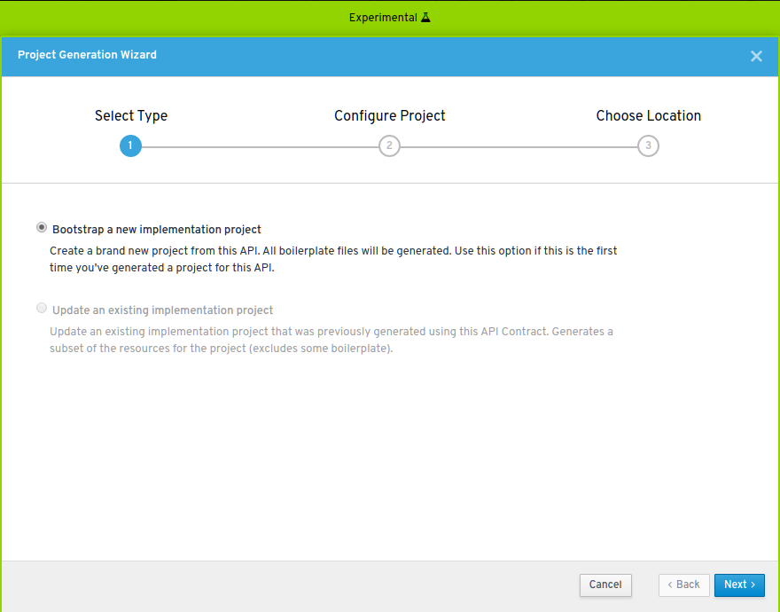
   * 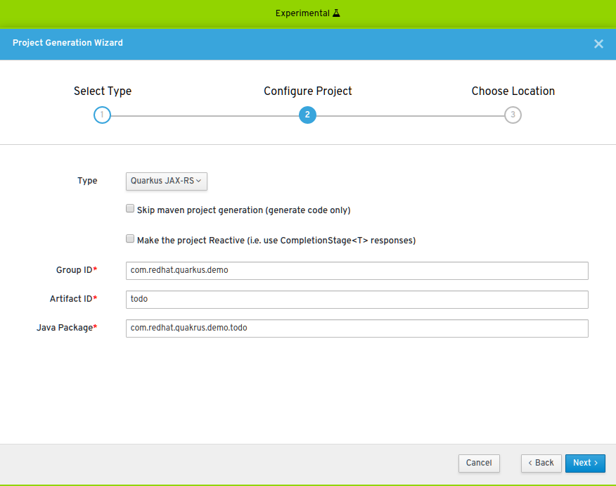
   * 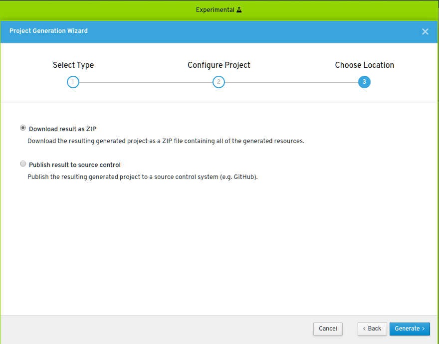
   * 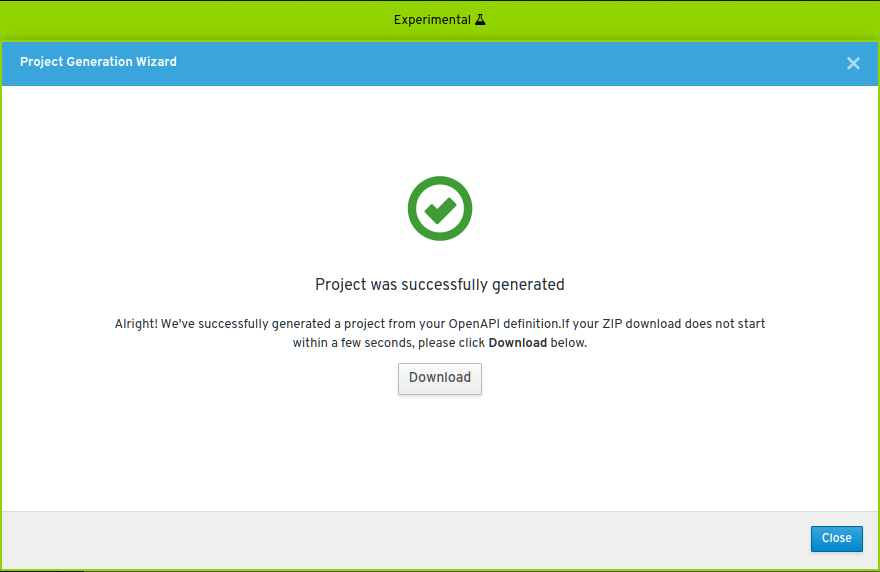
1. Extract your project and open it in your favorite IDE/Editor
   * 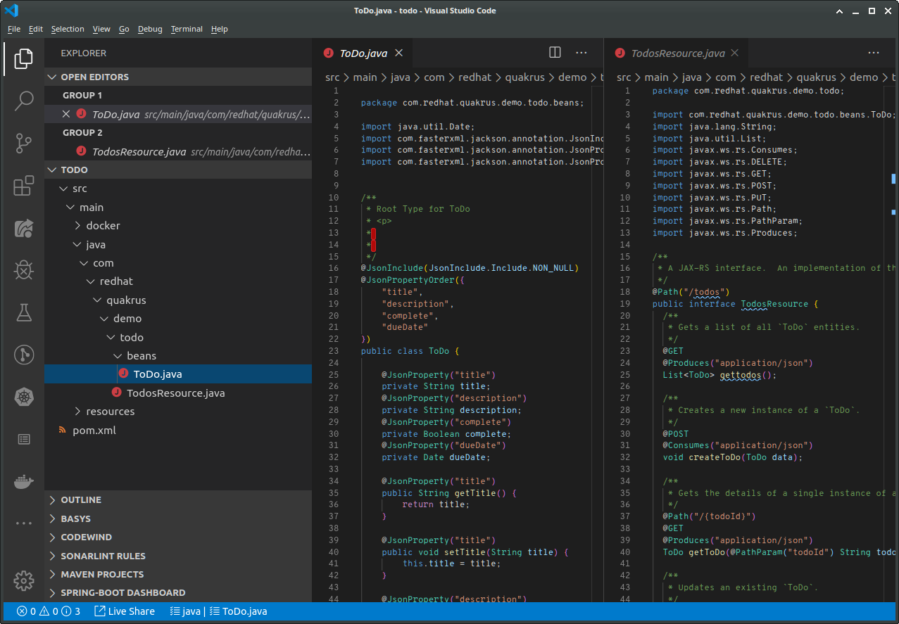
1. Now, all that you need to do to complete this API project is implement the interface and modify the Bean to be a Panache Entity
   * Open a terminal inside of your project
   * Run `mvn quarkus:add-extensions -Dextensions="jdbc-h2,hibernate-orm-panache"`
   * Open the `src/main/resources/application.properties` file and add the following: 
   ```
   quarkus.datasource.driver=org.h2.Driver
   quarkus.datasource.url=jdbc:h2:mem:todo
   quarkus.datasource.username=sa
   quarkus.datasource.password=password
   quarkus.hibernate-orm.database.generation = drop-and-create
   
   quarkus.http.cors=true
   ```
   * Modify the `src/main/java/.../Todo.java` POJO/Bean to be a PanacheEntity:
     * 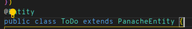
   * Finally, we implement the `TodosResource` interface:
   ```java
   package com.redhat.quakrus.demo.todo;
   
   import java.util.List;
   import javax.enterprise.context.RequestScoped;
   
   import com.redhat.quakrus.demo.todo.beans.ToDo;
   
   @RequestScoped
   public class TodosResourceImpl implements TodosResource {
   
     @Override
     public List<ToDo> gettodos() {
       return ToDo.listAll();
     }
   
     @Override
     public void createToDo(ToDo data) {
       ToDo.persist(data);
     }
   
     @Override
     public ToDo getToDo(String todoId) {
       return ToDo.findById(todoId);
     }
   
     @Override
     public void updateToDo(String todoId, ToDo data) {
       ToDo existing = ToDo.findById(todoId);
       existing.setTitle(data.getTitle());
       existing.setDescription(data.getDescription());
       existing.setDueDate(data.getDueDate());
       existing.setComplete(data.getComplete());
       existing.persist();
     }
   
     @Override
     public void deleteToDo(String todoId) {
       ToDo.findById(todoId).delete();
     }
   }
   ```
   * Start the application: `mvn clean compile quarkus:dev`
   ```
   2019-12-03 08:25:35,961 INFO  [io.qua.dev] (main) Changed source files detected, recompiling [/tmp/todo/src/main/java/com/redhat/quakrus/demo/todo/TodosResource.java]
   2019-12-03 08:25:36,249 INFO  [io.qua.dep.QuarkusAugmentor] (main) Beginning quarkus augmentation
   2019-12-03 08:25:36,879 INFO  [io.qua.dep.QuarkusAugmentor] (main) Quarkus augmentation completed in 630ms
   2019-12-03 08:25:36,956 INFO  [io.qua.swa.run.SwaggerUiServletExtension] (main) Swagger UI available at /swagger-ui
   2019-12-03 08:25:37,298 INFO  [io.quarkus] (main) Quarkus 0.23.2 started in 1.446s. Listening on: http://0.0.0.0:8080
   2019-12-03 08:25:37,299 INFO  [io.quarkus] (main) Profile dev activated. Live Coding activated.
   2019-12-03 08:25:37,299 INFO  [io.quarkus] (main) Installed features: [agroal, cdi, hibernate-orm, jdbc-h2, narayana-jta, resteasy, resteasy-jackson, smallrye-openapi, swagger-ui]
   ```
   * Open the Swagger UI: http://localhost:8080/webjars/swagger-ui/3.20.9/index.html
   * Enter `http://localhost:8080/openapi` for the location of the spec
   * Make a **GET** request: 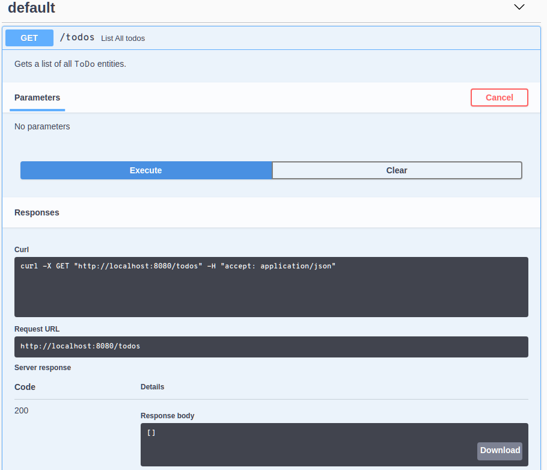
   
### Method 2: Using OpenAPI Generator and Custom Templates (This Project)

1. Clone this project locally: `git clone https://github.com/InfoSec812/quarkus-openapi-todo-demo.git`
1. Follow the steps from above about creating the OpenAPI specification using Apicur.io, but do not use the *Generate Project* option inside of Apicur.io
1. Save the OpenAPI specification in the root of this project as `openapi.yml`
   * |**WARNING**: *This Is NOT An Appropriate Solution* |
     |---|
     | Running this in a Maven multimodule project was done to simplify performing the demo, but is not a good solution for real-world development| 
     | For real-world development, each of these modules should be handled by a pipeline and publish their artifacts to a repository|
1. Using the scripts in the root of the project, we will execute some Maven goals to help us create our application
1. Generate the JavaScript/TypeScript client SDK using the script `1-build-js-client.sh`
   * This actually runs `./mvnw -pl jsclient clean build-helper:parse-version frontend:install-node-and-npm@installNode openapi-generator:generate@api-client-sources frontend:npm@install-deps frontend:npm@transpile-api-client`
1. Install the client SDK into the frontend VueJS application using the script `2-install-client-for-frontend`
   * This actually runs `./mvnw -pl frontend clean frontend:install-node-and-npm@installNode build-helper:parse-version frontend:npm@set-version frontend:npm@2-npm-install frontend:npm@3-npm-install-client-sdk`
1. Implement the client SDK in the VueJS application:
   * ```javascript
     import { DefaultApi } from 'todo-jsclient';
     
     const apiClient = new DefaultApi(null, "http://localhost:8080");
     
     export default {
     // ...SNIP...
     
       mounted() {
         // When first starting, the application needs to load the initial data from the
         // server. This uses the loading indicator and the generated Axios client SDK
         // to load the data while showing the user a loading indicator
         this.$q.loading.show();
         apiClient.gettodos()
           .then(res => {
             this.$data.todos = res.data;
             this.$q.loading.hide();
           }).catch(err => {
             this.$q.loading.hide();
             this.$q.notify("An error occurred while loading data from the server: " + JSON.stringify(err));
           })
       },
       methods: {
         // Given the index of an item to be deleted, make an API call to delete that ToDo
         deleteTodo: function(index) {
           apiClient.deleteTodo(this.$data.todos[index].id)
             .catch(err => {
               this.$q.notify("An error occurred while deleting the Todo: " + JSON.stringify(err));
             })
         },
         // Whenever a change is made to the data, this method is run to updated the
         // persisted data on the server
         updateTodo: function(index) {
           apiClient.updateTodo(this.$data.todos[index].id, this.$data.todos[index])
             .catch(err => {
               this.$q.notify("An error occurred while updating the Todo: " + JSON.stringify(err));
             })
         },
         // When a new ToDo is submitted, this method is called to persist the ToDo
         // object to the server
         addTodo: function () {
           apiClient.createTodo(this.$data.newTodo)
             .then(res => {
               this.$data.todos.push(res.data);
             })
             .catch(err => {
               this.$q.notify("An error occurred while adding Todo: " + JSON.stringify(err));
             })
         },
         // A method to show or hide the new ToDo form
         toggleTodoForm: function () {
           this.$data.showForm = !this.$data.showForm;
         }
       }
     }
     // ...SNIP...
   }
     ```
     * This client SDK is implemented in TypeScript and uses Axios (Promises-based Async API) to make the REST API calls with a very simple implementation workflow for the developer.
1. Transpile the frontend using `3-build-frontend.sh`
   * This actually runs `./mvnw -pl frontend frontend:npm@quasar-build`
1. Implement the server stubs inside of the `implementation` project.
   * Create a new class `TodosApiServiceImpl.java` which implements the `TodosApiService` interface which was generated for us
   * The implementation of the class looks like:
     ```java
     package com.redhat.quarkus.demo.todo;
     
     import com.redhat.demos.quarkus.openapi.todo.api.NotFoundException;
     import com.redhat.demos.quarkus.openapi.todo.api.TodosApiService;
     import com.redhat.demos.quarkus.openapi.todo.models.Todo;
     
     import javax.enterprise.context.RequestScoped;
     import javax.transaction.Transactional;
     import javax.ws.rs.core.Response;
     import javax.ws.rs.core.SecurityContext;
     
     @RequestScoped
     public class TodosApiServiceImpl implements TodosApiService {
       @Override
       @Transactional
       public Response createTodo(Todo todo, SecurityContext securityContext) throws NotFoundException {
         Todo.persist(todo);
         todo.flush();
         return Response.ok(todo).build();
       }
     
       @Override
       @Transactional
       public Response deleteTodo(String todoId, SecurityContext securityContext) throws NotFoundException {
         Todo.findById(todoId).delete();
         return Response.noContent().build();
       }
     
       @Override
       public Response getTodo(String todoId, SecurityContext securityContext) throws NotFoundException {
         return Response.ok(Todo.findById(todoId)).build();
       }
     
       @Override
       public Response gettodos(SecurityContext securityContext) throws NotFoundException {
         return Response.ok(Todo.listAll()).build();
       }
     
       @Override
       @Transactional
       public Response updateTodo(String todoId, Todo todo, SecurityContext securityContext) throws NotFoundException {
         Todo existing = Todo.findById(todoId);
         existing.setTitle(todo.getTitle());
         existing.setDescription(todo.getDescription());
         existing.setComplete(todo.isComplete());
         existing.setDueDate(todo.getDueDate());
         existing.persistAndFlush();
         return Response.ok(existing).build();
       }
     }
     ```
   * The DAO operations are implemented for us by the `PanacheEntity`. As a developer, all that we have to do is map the operations to methods which are exposed via the API
1. Configure Quarkus DataSource and JPA
   * Add the following to your `implementation/src/main/resources/application.properties` file
     ```properties
     quarkus.datasource.driver=org.h2.Driver
     quarkus.datasource.url=jdbc:h2:mem:todo
     quarkus.datasource.username=sa
     quarkus.datasource.password=password
     quarkus.hibernate-orm.database.generation = drop-and-create
     
     quarkus.http.cors=true
     ```
1. Let Quarkus know that we are including components from external libraries by using an empty `beans.xml` file in `implementation/src/main/resources/META-INF/beans.xml`
1. Build the completed application using `4-build-implementation.sh`
   * This actually runs:
     * `./mvnw -pl implementation,server clean package -DskipTests`
     * `java -jar implementation/target/todo-implementation-1.0.0-SNAPSHOT-runner.jar`
1. Open a browser to http://localhost:8080/